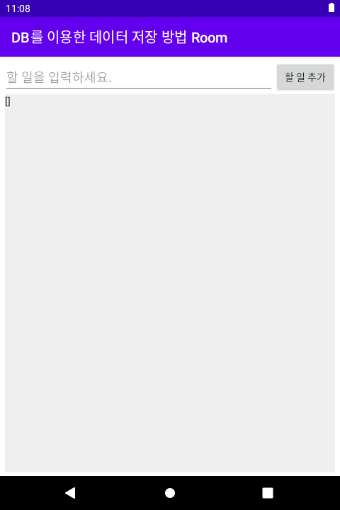
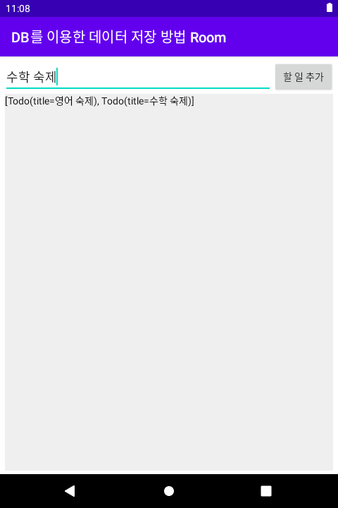

# 시작하며...

이 샘플 모듈의 개발 목적은 다음과 같습니다.

* Room 라이브러리를 활용하여 테이블 정의, 자료 추가하는 방법을 이해한다.

---

# 스크린샷

메인 화면에서 '할 일'을 입력하고 '할 일 추가' 버튼을 누르면, Todo 테이블에 새로운 할 일 자료가 추가됩니다. 
그리고 할 일 리스트가 화면에 보입니다. 

위 그림은 맨 처음 시작 화면입니다.

할 일 입력 후 '할 일 추가' 버튼을 클릭하면, 할 일 리스트가 위 그림과 같이 화면에 보입니다.

---

# 강의 URL

* [[Kotlin] DB를 이용한 데이터 저장방법 Room](https://www.inflearn.com/course/%EB%AA%A8%EB%8D%98-%EC%95%88%EB%93%9C%EB%A1%9C%EC%9D%B4%EB%93%9C-%EC%BD%94%ED%8B%80%EB%A6%B0-%EC%A0%9C%ED%8A%B8%ED%8C%A9/lecture/49130?tab=curriculum&volume=1.00&speed=1.25)